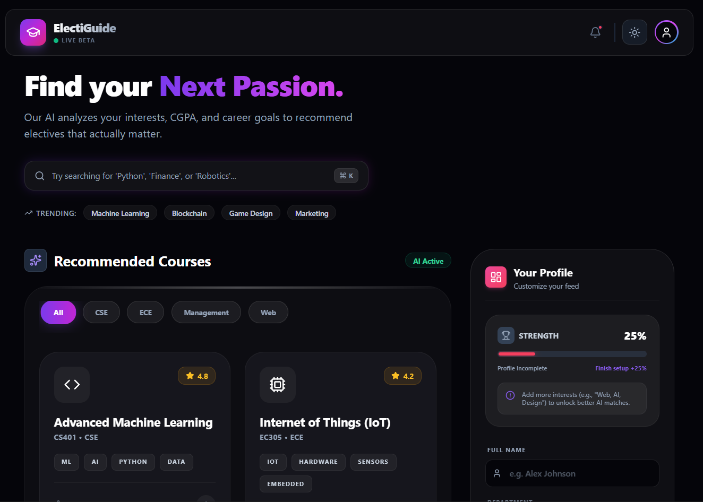

# 🎓 ElectiGuide



> **Find Your Next Passion.** > A next-generation Elective Recommendation System & PBL Marketplace featuring a cyberpunk aesthetic, AI-driven matching logic, and a gamified user experience.


## 🌟 About The Project

**ElectiGuide** solves the chaos of choosing college electives. Instead of scrolling through boring PDF syllabi, students get a Netflix-style experience to discover courses that actually align with their career goals.

Built with a focus on **UI/UX excellence**, it features a modern "Glassmorphism" design, dark mode support, and interactive feedback loops.

### ✨ Key Features

* **🧠 Smart Match Engine:** Calculates a dynamic percentage match (e.g., "98% Match") based on your CGPA and specific interests.
* **🎨 High-End UI:** Fully responsive interface featuring glass-morphism, neon gradients, and a "Cyberpunk/SaaS" aesthetic.
* **🌗 Dark/Light Mode:** Seamless theme switching with persistent state.
* **🏆 Gamified Profile:** Interactive "Profile Strength" meter that encourages students to complete their data with visual rewards.
* **⚡ Instant Search:** "Command Center" style search bar with trending tags for rapid discovery.
* **💎 Micro-Interactions:** Skeleton loaders, toast notifications, hover glows, and smooth transitions.

---

## 🛠️ Tech Stack

* **Frontend:** [React.js](https://reactjs.org/) (Vite)
* **Styling:** [Tailwind CSS](https://tailwindcss.com/)
* **Icons:** [Lucide React](https://lucide.dev/)
* **State Management:** React Hooks (`useState`, `useEffect`)

---

## 🚀 Getting Started

Follow these steps to set up the project locally.

### Prerequisites

* Node.js (v16 or higher)
* npm or yarn

### Installation

1.  **Clone the repository**
    ```bash
    git clone [https://github.com/your-username/ElectiGuide.git](https://github.com/your-username/ElectiGuide.git)
    ```
2.  **Navigate to the project directory**
    ```bash
    cd ElectiGuide
    ```
3.  **Install dependencies**
    ```bash
    npm install
    ```
4.  **Start the development server**
    ```bash
    npm run dev
    ```

---

## 🤝 Call for Contributors

We are actively looking for contributors to help take ElectiGuide to the next level! Whether you are a beginner or a pro, your help is welcome.

### 🚧 Roadmap & To-Do
Here are some areas where you can contribute:

- [ ] **Backend Integration:** Connect the frontend to a real Node.js/Express backend.
- [ ] **Authentication:** Implement login/signup using Firebase or Auth0.
- [ ] **Database:** Store real course data in MongoDB or PostgreSQL.
- [ ] **Mobile Optimization:** Fine-tune the "Profile" sidebar for smaller mobile screens.
- [ ] **Data Visualization:** Add charts for "Grade Distribution" in the course modal.

### How to Contribute

1.  **Fork** the project.
2.  Create your Feature Branch (`git checkout -b feature/AmazingFeature`).
3.  Commit your Changes (`git commit -m 'Add some AmazingFeature'`).
4.  Push to the Branch (`git push origin feature/AmazingFeature`).
5.  Open a **Pull Request**.

---

## 📂 Project Structure

```text
frontend/
├── src/
│   ├── components/
│   │   ├── Electives.jsx    # Course grid, filtering logic, and modals
│   │   ├── StudentForm.jsx  # Profile inputs and Strength Meter
│   ├── App.jsx              # Main layout, Hero section, Theme provider
│   ├── index.css            # Tailwind imports and custom animations
│   └── main.jsx             # Entry point
└── ...


---

## 📂 Project Structure

```text
frontend/
├── src/
│   ├── components/
│   │   ├── Electives.jsx    # Course grid, filtering logic, and modals
│   │   ├── StudentForm.jsx  # Profile inputs and Strength Meter
│   ├── App.jsx              # Main layout, Hero section, Theme provider
│   ├── index.css            # Tailwind imports and custom animations
│   └── main.jsx             # Entry point
└── ...
👤 Author
Ansh Mishra Lead Developer & UI Designer

If you like this project, please give it a ⭐️ on GitHub!